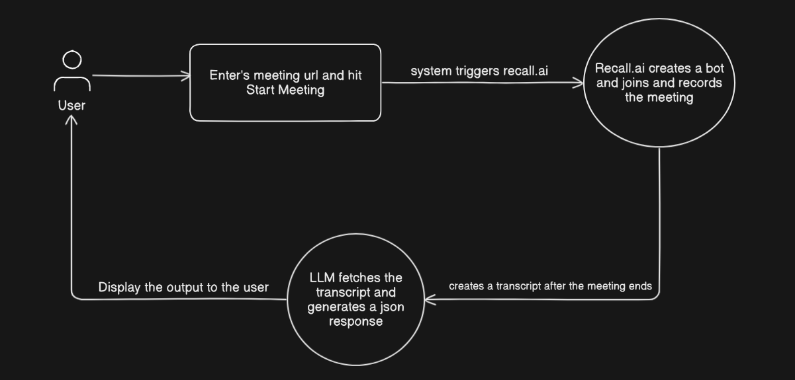

# 1on1 - AI-Powered Meeting Note Taker

An intelligent meeting assistant that automatically joins your video calls, records conversations, and generates structured insights using AI. The system integrates with Recall.ai for meeting recording and Google's Gemini AI for generating comprehensive meeting summaries, action items, key decisions, next steps, deadlines, and unresolved questions.



## Features

- **Automatic Meeting Recording**: Bot joins Google Meet, Zoom, or Teams calls
- **AI-Generated Insights**: Structured summaries with action items, decisions, and next steps
- **Real-time Processing**: Automatic transcript processing and insight generation
- **Modern UI**: Clean, responsive interface with organized insight cards
- **Polling System**: Real-time updates on meeting status and completion

## How to Run Locally

### Prerequisites
- Node.js 18+ installed
- MongoDB database (local or cloud)
- Recall.ai API key
- Google Gemini API key

### Setup

1. **Clone and install dependencies**
   ```bash
   git clone <repository-url>
   cd note-taker
   npm install
   ```

2. **Environment Configuration**
   Create `.env.local` file with:
   ```env
   MONGODB_URI=your_mongodb_connection_string
   RECALL_API_KEY=your_recall_api_key
   GEMINI_API_KEY=your_gemini_api_key
   NEXT_PUBLIC_BASE_URL=http://localhost:3000
   ```

3. **Start the application**
   ```bash
   npm run dev
   ```

4. **Access the application**
   Open [http://localhost:3000](http://localhost:3000) in your browser

### Usage

1. Enter your meeting URL (Google Meet, Zoom, or Teams)
2. Click "Start Meeting" to deploy the recording bot
3. The bot will join your meeting and record the conversation
4. After the meeting ends, AI will automatically generate structured insights
5. View organized summaries, action items, decisions, and next steps

## Tech Stack

- **Frontend**: Next.js 15, React, TypeScript, Tailwind CSS
- **Backend**: Next.js API Routes, MongoDB, Mongoose
- **AI Services**: Google Gemini AI, Recall.ai
- **Architecture**: Component-based UI, Controller-Service pattern